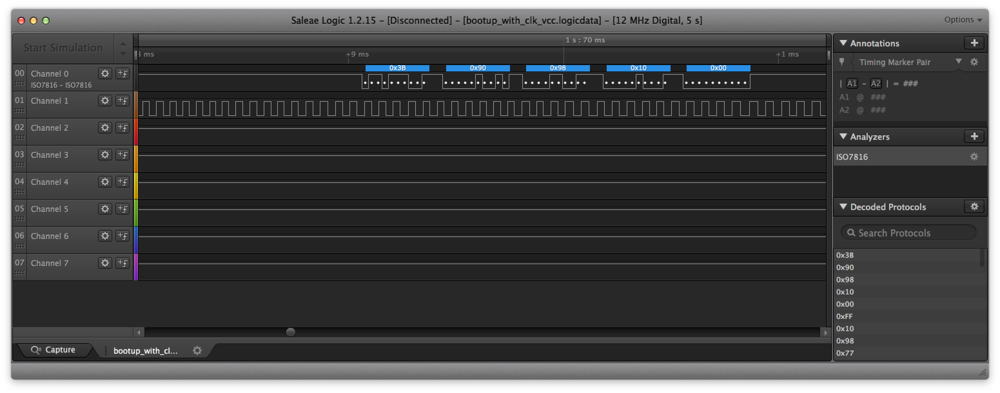
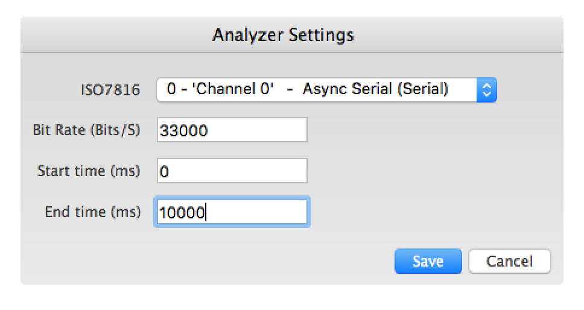

# ISO7816Analyzer

This is a logic analyzer plugin for ISO7816, the protocol usde by smartcards and secure elemnts.

It can be used to analyze a wide variety of things, for example:
- Credit card communication between a PoS-terminal and the card
- Secure Element communication on Bitcoin wallets (For example on the Ledger Nano S)
- etc

It also supports settings the range on which it analyzes - this is useful when the card switches between different speeds.

## Screenshots

Example of the analyzer in action: The ATR of a Ledger Nano S:


The configuration dialog:



## Building

First, make sure that you cloned the repository including the submodules:

```
git clone --recursive https://github.com/nezza/ISO7816Analyzer.git
```

And then simply run:

```
python3 build_analyzer.py
```
